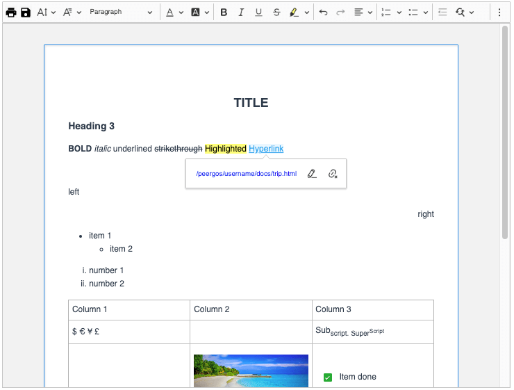
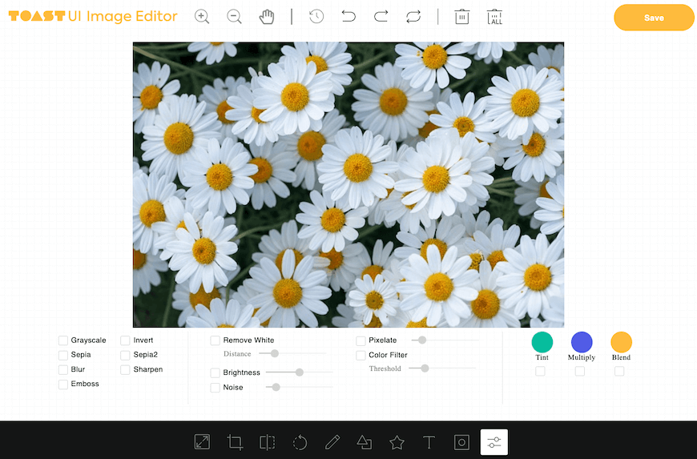
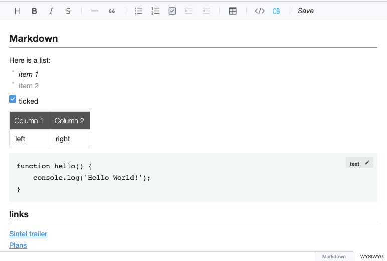
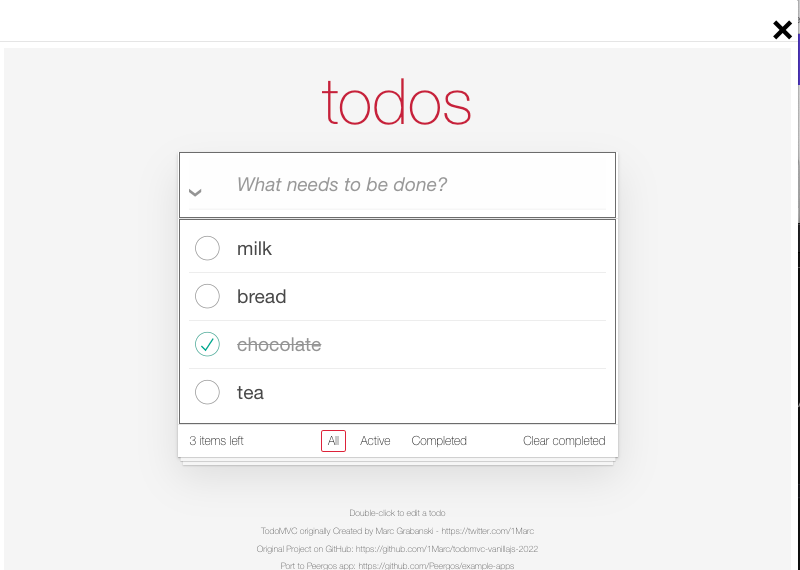
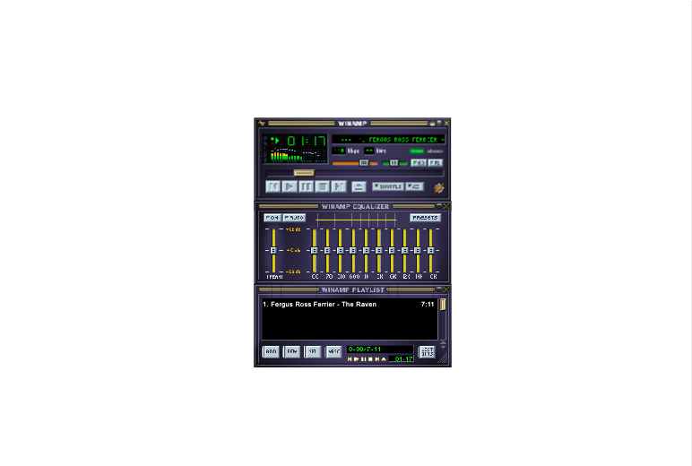
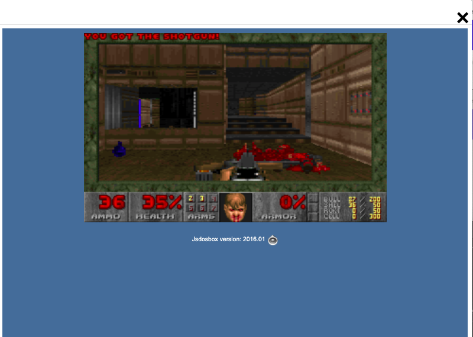
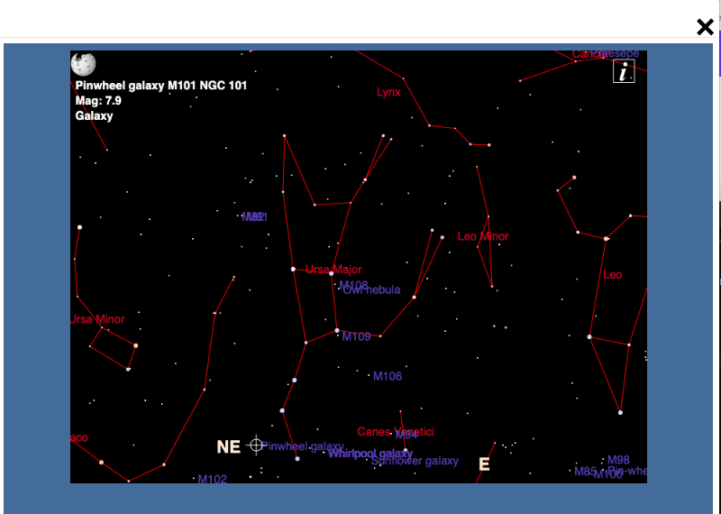

# example-apps
A collection of example apps for running in Peergos

### Installation
1. From the top of this page click the green 'Code' button and select 'Download Zip'.
2. Unzip file and upload desired application folder to Peergos
3. Navigate into application folder, open the context menu for the file 'peergos-app.json' and choose 'Install App'
4. Make sure to take note of the file associations and permissions requested
5. Installed Apps are displayed on the Launcher page (top icon in left menu)

## CK-Editor
#### https://github.com/ckeditor/ckeditor5

Rich text editor. Loads/Saves .html files

    

## TUI Image Editor
#### https://github.com/nhn/tui.image-editor

## TUI Markdown WYSIWYG Markdown Editor
#### https://github.com/nhn/tui.editor

## TodoMVC
#### https://github.com/1Marc/todomvc-vanillajs-2022

    

## Winamp 2 implemented in JavaScript
#### https://github.com/captbaritone/webamp

## Doom (Shareware) running inside jsdosbox
#### https://sourceforge.net/projects/jsdosbox

    

## Astronomy sky map
#### https://sourceforge.net/projects/ikpegasi

    

## Chat-api
Example of how to use the chat-api for App communication (eg multi-player games)

