# example-apps
A collection of example apps for running in Peergos

If you stumbled here without knowing what Peergos is, try this:

github.com/Peergos/peergos

### Installation
If you are self-hosting or have an account on peergos.net or peergos-demo.net
1. click the launcher icon (top icon on left hand side menu)
2. click recommended apps button
3. click install next to desired app

Manual instructions for additional/experimental apps
1. From the top of this page click the green 'Code' button and select 'Download Zip'.
2. Unzip file and upload desired application folder to Peergos
3. Navigate into application folder, open the context menu for the file 'peergos-app.json' and choose 'Install App'
4. Make sure to take note of the file associations and permissions requested
5. Installed Apps are displayed on the Launcher page (top icon in left menu)

### Developer documentation
#### https://book.peergos.org/features/apps.html

## CK-Editor
#### https://github.com/ckeditor/ckeditor5

Rich text editor. Loads/Saves .html files
See doc2html app below to convert other document formats to html
    

## Doc2Html. Convert .docx and .odt files to .html files
#### https://github.com/mwilliamson/mammoth.js/ github.com/xwiki-labs/office-converter

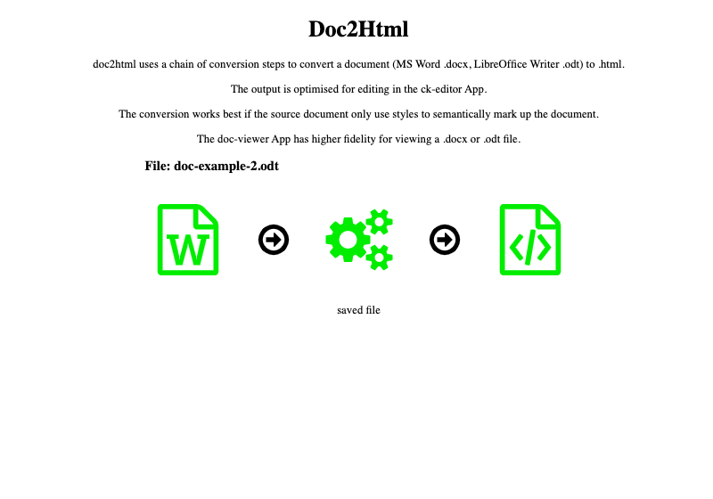

## Html2docx. Convert .html to .docx files
#### https://github.com/t3rmian/html-to-docx-js-client-demo

## Document Viewer. View .docx and .odt files
#### https://github.com/VolodymyrBaydalka/docxjs, https://github.com/xwiki-labs/office-converters

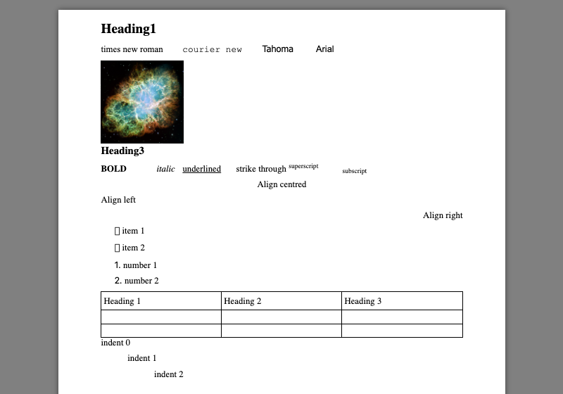

## LuckySheet Spreadsheet
#### https://github.com/dream-num/Luckysheet https://github.com/xwiki-labs/office-converters
data is stored in a a json formatted file with extension .sheet 
Can import to some degree xlsx, ods spreadsheet files
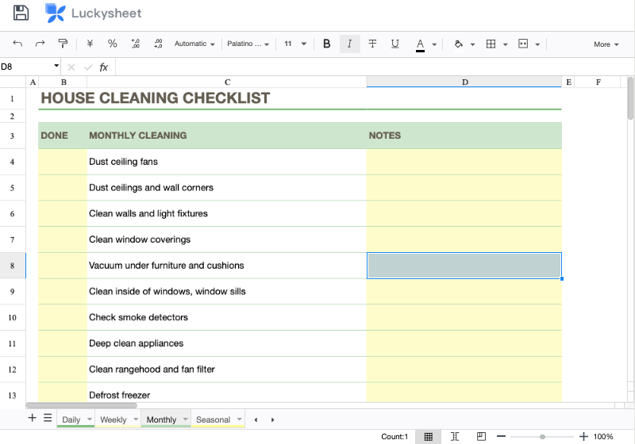

## .docx extractor. Save content as .html (Formatting not preserved)
#### https://gitlab.coko.foundation/XSweet/XSweet

**Before installing, download SaxonJS2.js from https://www.saxonica.com/saxon-js/index.xml and copy into assets folder**

## Tldraw Drawing & Whiteboard. Edit .tldr files
#### https://github.com/tldraw/tldraw

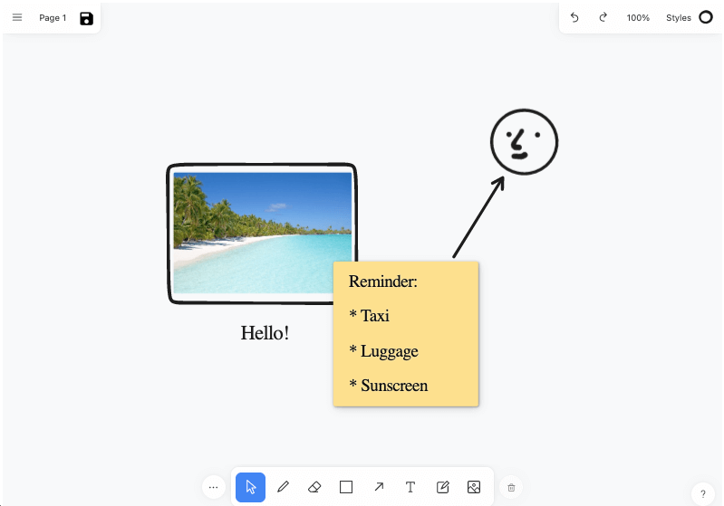

## Draw.io Diagramming and visualization. Edit .drawio files
#### https://github.com/jgraph/drawio

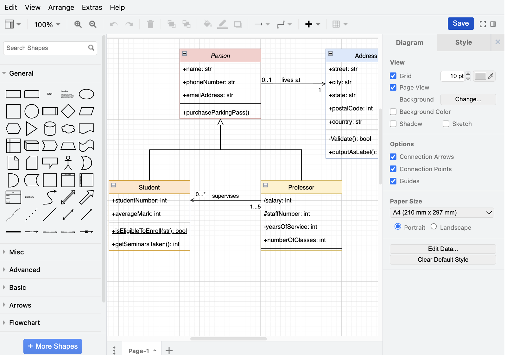

## Block-style editor. Based on editor.js. Edit .note files
#### https://github.com/codex-team/editor.js

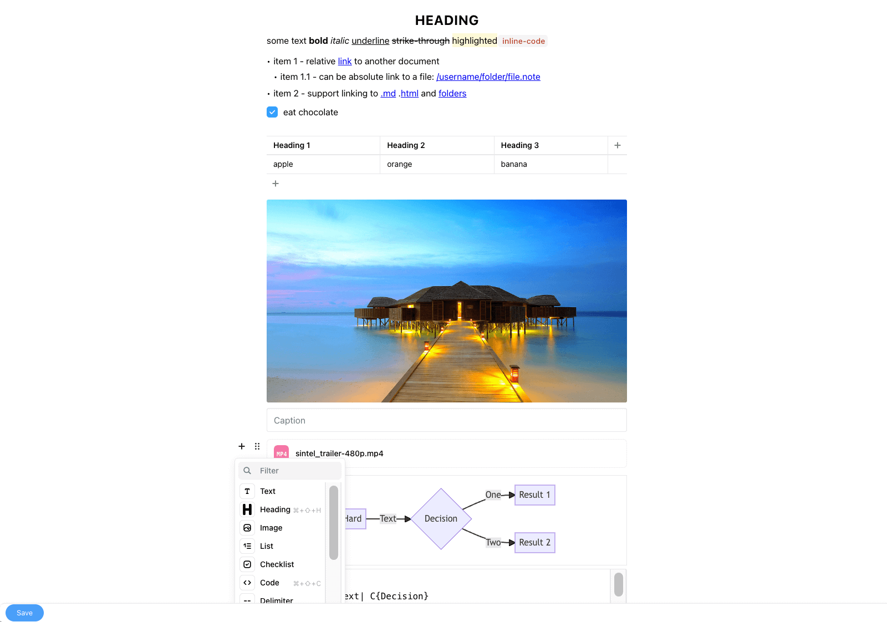

## TUI Image Editor
#### https://github.com/nhn/tui.image-editor

## PaintZ MS Paint clone
#### https://github.com/zmyaro/paintz

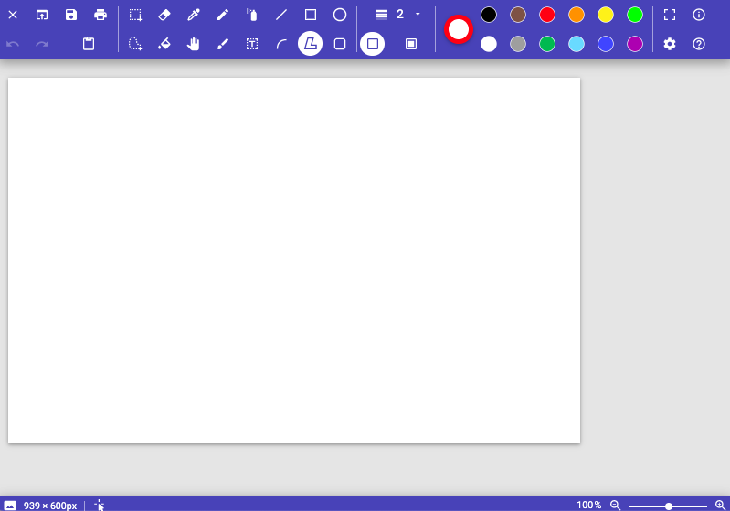

## jspaint - Classic MS Paint clone
#### https://github.com/1j01/jspaint

## TUI Markdown WYSIWYG Markdown Editor
#### https://github.com/nhn/tui.editor

## TodoMVC
#### https://github.com/1Marc/todomvc-vanillajs-2022

    

## Scientific Calculator
#### https://github.com/intel/webapps-scientific-calculator

## Winamp 2 implemented in JavaScript
#### https://github.com/captbaritone/webamp

## Audio Player - play all audio files in a folder
#### https://luna.liriliri.io/?path=/story/music-player--music-player

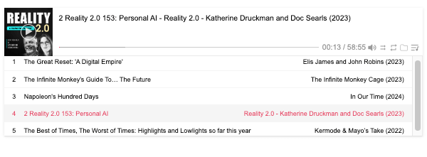

## Image Slideshow - view all image files in a folder
#### https://luna.liriliri.io/?path=/story/gallery--gallery

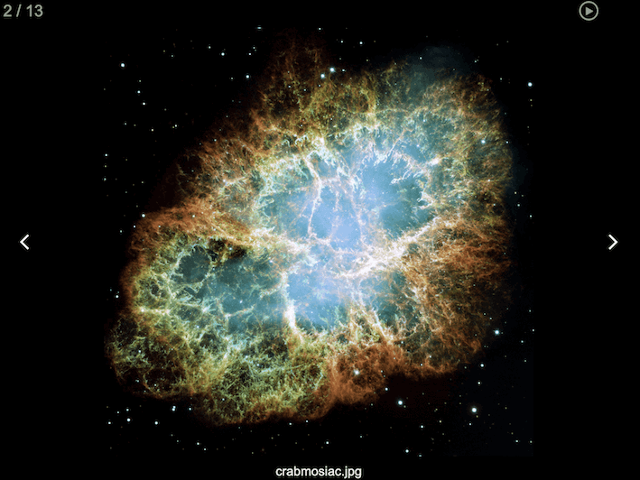

## TiddlyWiki 5 - a non-linear personal web notebook
#### https://github.com/Jermolene/TiddlyWiki5

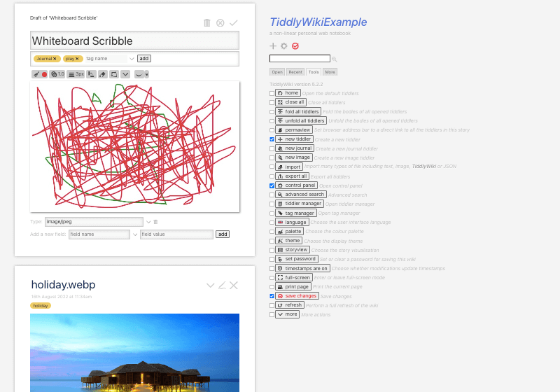

## Device Capture

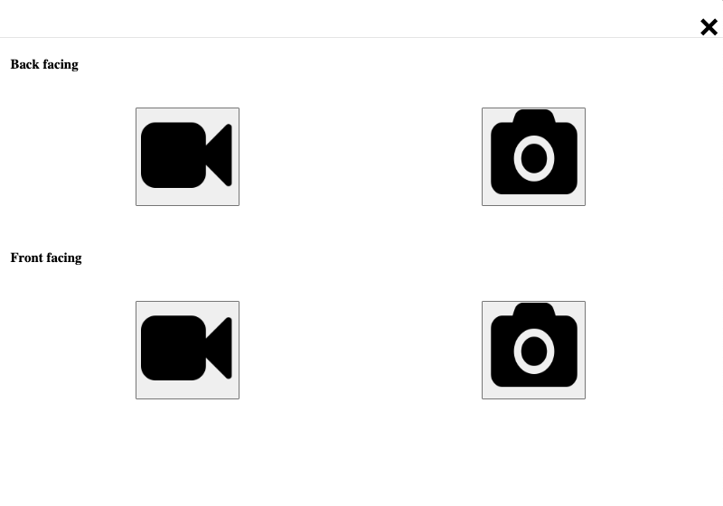

## VLC media player
#### https://github.com/Krowemoh/vlc.js

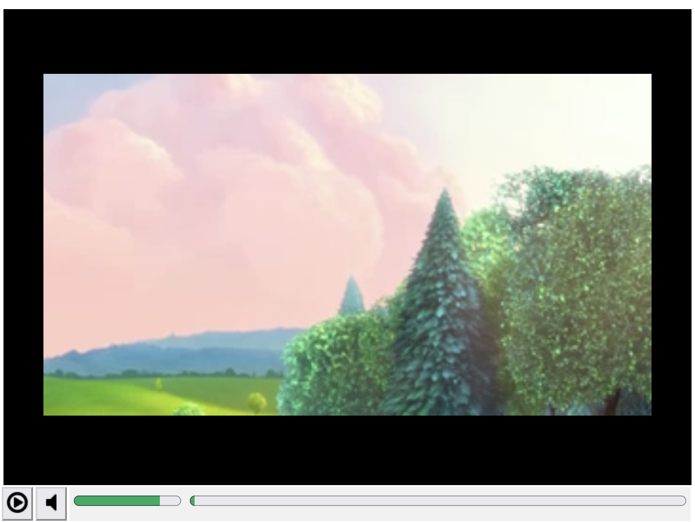

## Doom (Shareware) running inside jsdosbox
#### https://sourceforge.net/projects/jsdosbox

    

## Astronomy sky map
#### https://sourceforge.net/projects/ikpegasi

    

## Chat-api
Example of how to use the chat-api for App communication (eg multi-player games)

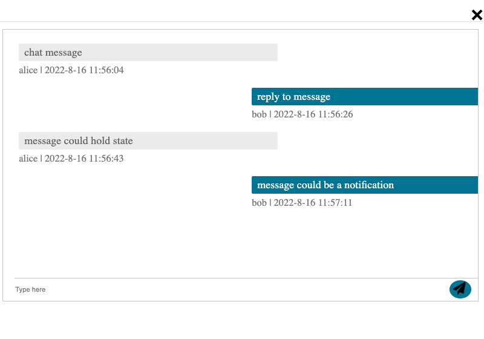  

## audio-recorder
#### https://wavesurfer.xyz
audio recording app - incomplete and non-functional

## ebook-reader
#### https://github.com/futurepress/epubjs-reader/
Read epub files

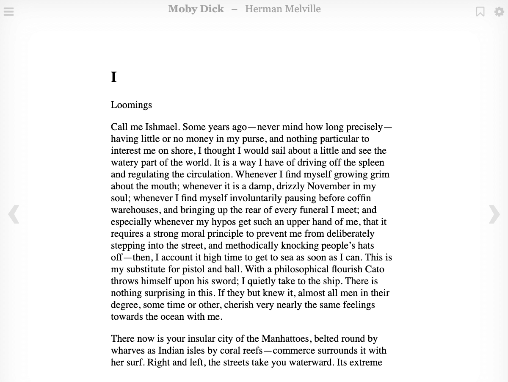  

## text-editor
very simple text-editor using a html textarea

## Chess (over chat-api)
#### https://github.com/webxdc/ChessBoard.xdc

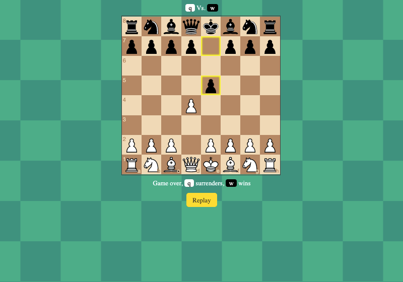  

## TicTacToe (over chat-api)
#### https://github.com/webxdc/tictactoe.xdc

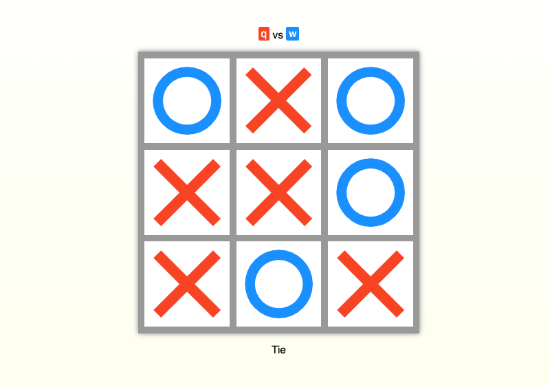  

## file-picker
Example of how to use the file picker api call

## folder-picker
Example of how to use the folder picker api call

