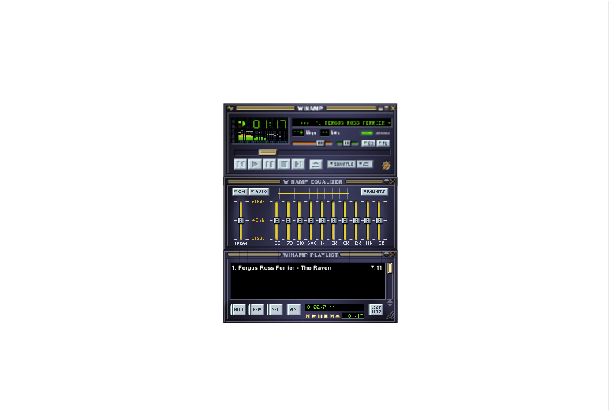

# example-apps
A collection of example apps for running in Peergos

If you stumbled here without knowing what Peergos is, try this:

github.com/Peergos/peergos

### Installation
1. From the top of this page click the green 'Code' button and select 'Download Zip'.
2. Unzip file and upload desired application folder to Peergos
3. Navigate into application folder, open the context menu for the file 'peergos-app.json' and choose 'Install App'
4. Make sure to take note of the file associations and permissions requested
5. Installed Apps are displayed on the Launcher page (top icon in left menu)

### Developer documentation
#### https://book.peergos.org/features/apps.html

## CK-Editor
#### https://github.com/ckeditor/ckeditor5

Rich text editor. Loads/Saves .html files

    

## .docx extractor. Save content as .html (Formatting not preserved)
#### https://gitlab.coko.foundation/XSweet/XSweet

**Before installing, download SaxonJS2.js from https://www.saxonica.com/saxon-js/index.xml and copy into assets folder**

## Tldraw Drawing & Whiteboard. Edit .tldr files
#### https://github.com/tldraw/tldraw

## TUI Image Editor
#### https://github.com/nhn/tui.image-editor

## PaintZ MS Paint clone
#### https://github.com/zmyaro/paintz

## TUI Markdown WYSIWYG Markdown Editor
#### https://github.com/nhn/tui.editor

## TodoMVC
#### https://github.com/1Marc/todomvc-vanillajs-2022

    

## Winamp 2 implemented in JavaScript
#### https://github.com/captbaritone/webamp

## TiddlyWiki 5 - a non-linear personal web notebook
#### https://github.com/Jermolene/TiddlyWiki5

## Device Capture

## Doom (Shareware) running inside jsdosbox
#### https://sourceforge.net/projects/jsdosbox

    

## Astronomy sky map
#### https://sourceforge.net/projects/ikpegasi

    

## Chat-api
Example of how to use the chat-api for App communication (eg multi-player games)

  

## Chess (over chat-api)
#### https://github.com/webxdc/ChessBoard.xdc

  

## TicTacToe (over chat-api)
#### https://github.com/webxdc/tictactoe.xdc

  

