# example-apps
A collection of example apps for running in Peergos

If you stumbled here without knowing what Peergos is, try this:

Peergos repository [https://github.com/Peergos/peergos](https://github.com/Peergos/peergos).

### Installation
If you are self-hosting or have an account on peergos.net or peergos-demo.net
1. click the launcher icon (top icon on left hand side menu)
2. click custom apps button
3. click install next to desired app

Manual instructions for additional/experimental apps
1. From the top of this page click the green 'Code' button and select 'Download Zip'.
2. Unzip file and upload desired application folder to Peergos
3. Navigate into application folder, open the context menu for the file 'peergos-app.json' and choose 'Install App'
4. Make sure to take note of the file associations and permissions requested
5. Installed Apps are displayed on the Launcher page (top icon in left menu)

### Developer documentation
#### https://book.peergos.org/features/apps.html

## CK-Editor
#### https://github.com/ckeditor/ckeditor5

Rich text editor. Loads/Saves .html files
See doc2html app below to convert other document formats to html
    

## Doc2Html
#### https://github.com/mwilliamson/mammoth.js/ 
#### https://github.com/xwiki-labs/office-converter

Convert .docx and .odt files to .html files
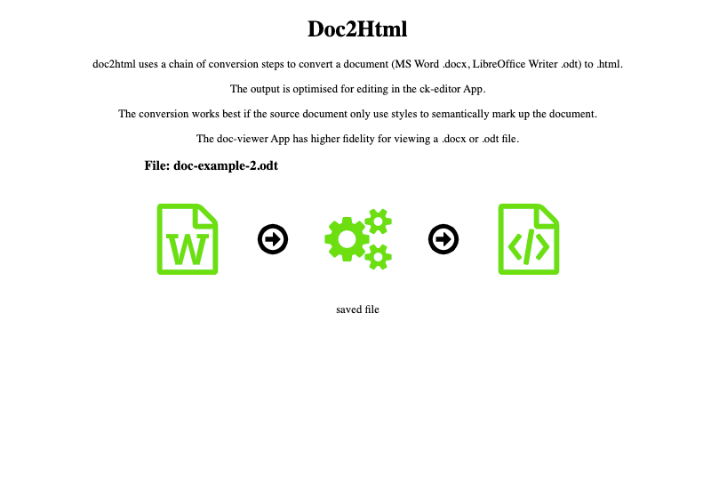

## Html2doc
#### https://github.com/t3rmian/html-to-docx-js-client-demo

Convert .html to .docx files

## Document-Viewer
#### https://github.com/VolodymyrBaydalka/docxjs
#### https://github.com/xwiki-labs/office-converters

View .docx and .odt files

## LuckySheet
#### https://github.com/dream-num/Luckysheet
#### https://github.com/xwiki-labs/office-converters

Spreadsheet.  Data is stored in a a json formatted file with extension .sheet 

Can import to some degree xlsx, ods spreadsheet files

## LuckySheet2Excel
#### https://github.com/dream-num/Luckysheet
#### https://github.com/yatessss/Luckyexcel

Convert Luckysheet .sheet file to a Microsoft Excel xlsx file. Very experimental and not supported. 

## .docx extractor. Save content as .html (Formatting not preserved)
#### https://gitlab.coko.foundation/XSweet/XSweet

**Before installing, download SaxonJS2.js from https://www.saxonica.com/saxon-js/index.xml and copy into assets folder**

## Tldraw
#### https://github.com/tldraw/tldraw-v1

Drawing & Whiteboard. Edit .tldr files.

This is the original 2021-2022 version, released under MIT. 

## Draw.io
#### https://github.com/jgraph/drawio

Diagramming and visualization. Edit .drawio files

## Notes
#### https://github.com/codex-team/editor.js

Block-style editor. Edit .note files
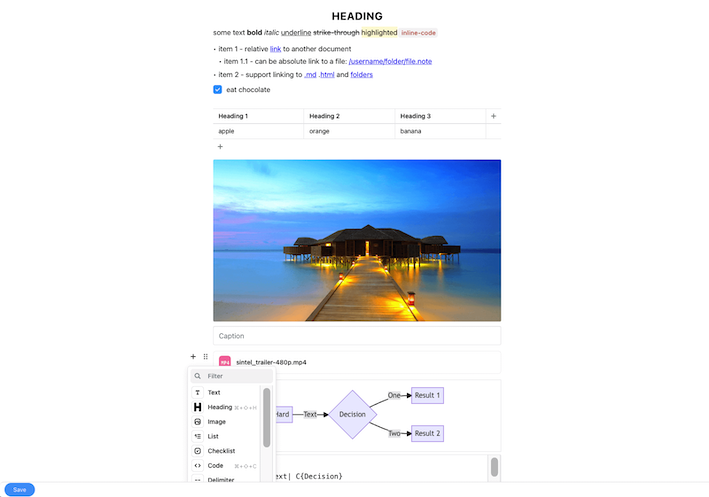

## TUI-Image-Editor
#### https://github.com/nhn/tui.image-editor

## PaintZ
#### https://github.com/zmyaro/paintz

MS Paint clone
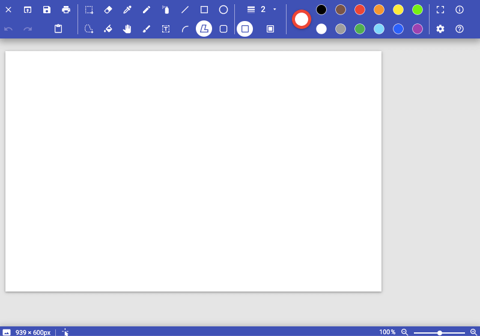

## jspaint
#### https://github.com/1j01/jspaint

Classic MS Paint clone
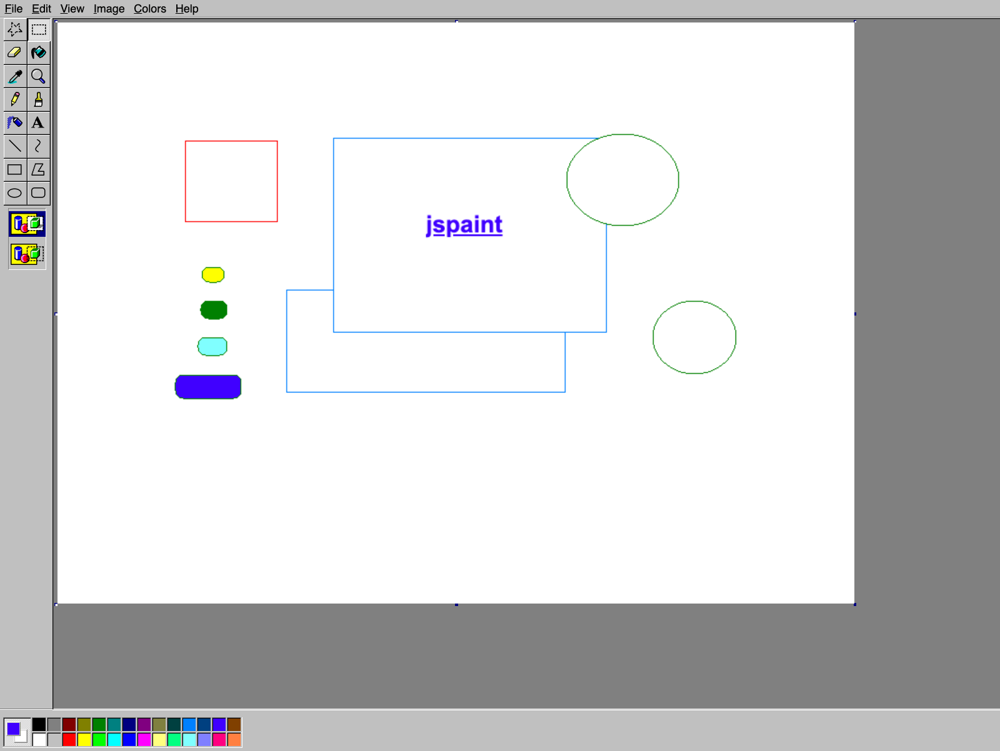  

## TUI-Markdown
#### https://github.com/nhn/tui.editor

WYSIWYG Markdown Editor

## Todo
#### https://github.com/DumbWareio/DumbKan

   

## Tasks

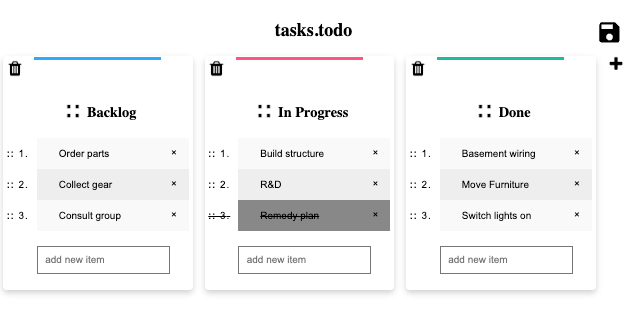    

## TodoMVC
#### https://github.com/1Marc/todomvc-vanillajs-2022

    

## Calculator
#### https://github.com/intel/webapps-scientific-calculator

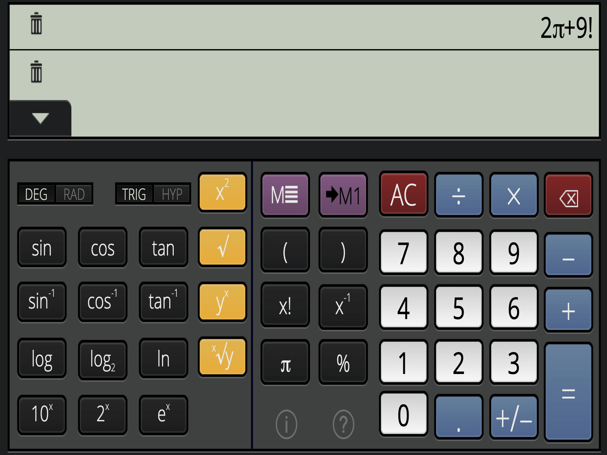 

## Webamp
#### https://github.com/captbaritone/webamp

Winamp 2 implemented in JavaScript

## Audio Player
#### https://luna.liriliri.io/?path=/story/music-player--music-player

Play all audio files in a folder

## Image Slideshow
#### https://luna.liriliri.io/?path=/story/gallery--gallery

View all image files in a folder

## TiddlyWiki
#### https://github.com/Jermolene/TiddlyWiki5

A non-linear personal web notebook

## Device Capture

## VLC.js
#### https://github.com/Krowemoh/vlc.js

Media player
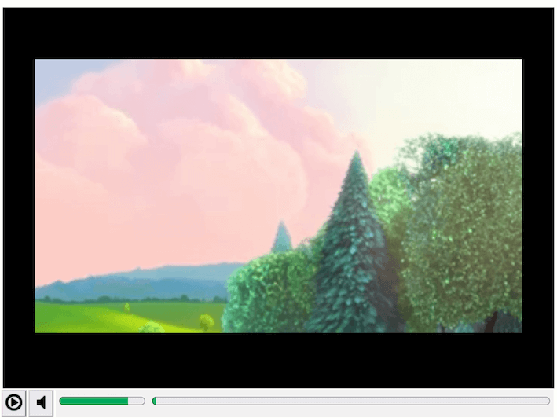

## Doom (Shareware)
#### https://sourceforge.net/projects/jsdosbox

Doom running inside jsdosbox emulator
    

## Astronomy sky map
#### https://sourceforge.net/projects/ikpegasi

    

## Chat-api
Example of how to use the chat-api for App communication (eg multi-player games)

  

## Chat
Example of how to use the chat-api (v1)

## audio-recorder
#### https://wavesurfer.xyz
audio recording app - incomplete and non-functional

## ebook-reader
#### https://github.com/futurepress/epubjs-reader/
Read epub files

  

## email-client

Example of using mailbox api
  

## pretty-diff
#### https://github.com/prettydiff/prettydiff

Display the difference between two text files
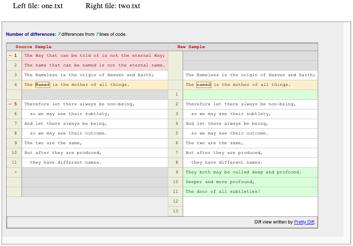  

## image-viewer
#### https://github.com/ThaUnknown/pwa-haven/tree/main/img-viewer

Display/Rotate/Scale an image file
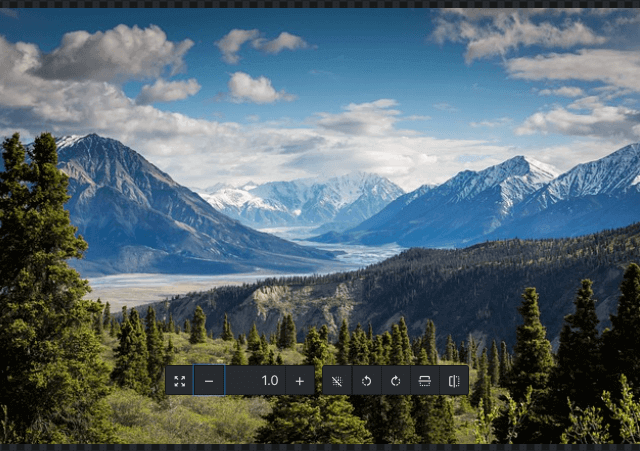 

## Sudoku
#### https://github.com/raravi/sudoku

Play Sudoku
 

## Projectify
#### https://github.com/thaddeusjiang/projectify

Project management app for TiddlyWiki: 
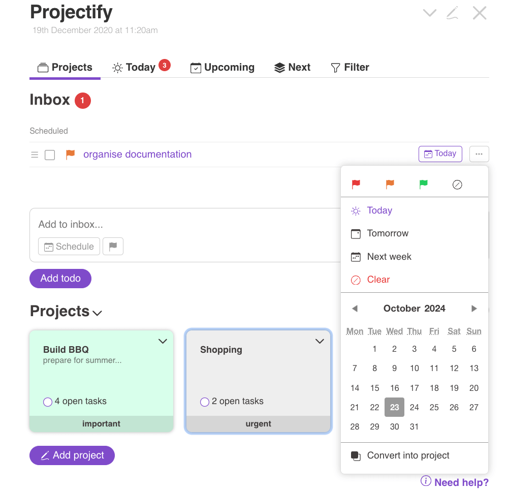 

## Feather-Wiki
#### https://codeberg.org/Alamantus/FeatherWiki

A tiny tool for simple, self-contained wikis
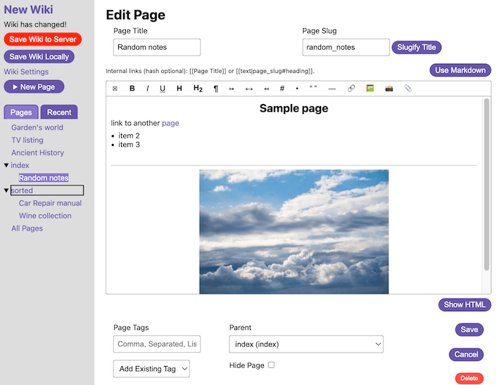 

## Album
#### https://github.com/disintegration/quiet

Create shareable albums
 

## Forum
#### https://github.com/disintegration/bebop

Create forums
 

## Exiftool
#### https://github.com/uswriting/exiftool/

Read media file metadata using Exiftool compiled to webassembly
 

## text-editor
very simple text-editor using a html textarea

## Chess
#### https://github.com/webxdc/ChessBoard.xdc

Chess over chat-api
  

## TicTacToe
#### https://github.com/webxdc/tictactoe.xdc

TicTacToe over chat-api
  

## file-picker
Example of how to use the file picker api call

## folder-picker
Example of how to use the folder picker api call

